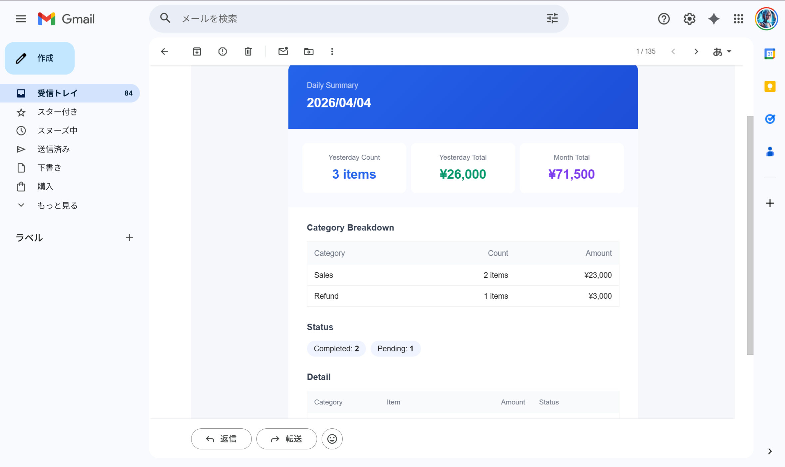

# 日次レポート自動送信 — Google Apps Script

Googleスプレッドシートのデータを毎朝自動集計し、メールで送信します。手作業ゼロ。

---

## こんなお悩みありませんか？

| 今まで | 導入後 |
|--------|--------|
| 毎朝シートを開いて数字を確認 | 朝7時にメールが届いている |
| 数字をコピペしてメールを作成 | HTMLメールが自動生成・送信済み |
| 合計・KPIを手計算 | カテゴリ別集計が自動で完成 |

---

## 主な機能

- 日次・週次レポート — 用途に応じて切り替え可能
- 列名自動検出 — 日本語ヘッダー（日付・金額・カテゴリ等）に対応
- HTML形式メール — Gmail・Outlook両対応の見やすいレイアウト
- エラーログ — 失敗時はログシートに記録＋アラートメール送信
- スタンドアロン対応 — 既存スプレッドシートに設定するだけで動作

---

## サンプル出力



---

## セットアップ手順

### 1. スプレッドシートを用意する

以下のヘッダー名で列を作成してください（日本語対応）:

| 列 | ヘッダー例 |
|----|-----------|
| 日付 | `日付`, `日時`, `date` |
| カテゴリ | `カテゴリ`, `分類`, `category` |
| 項目 | `項目`, `内容`, `品名`, `item` |
| 金額 | `金額`, `売上`, `amount` |
| ステータス | `ステータス`, `状態`, `status` |

### 2. スクリプトの設定を編集する

`daily_report_automation.js` の `CONFIG` を編集:

```javascript
const CONFIG = {
  SPREADSHEET_ID: "スプレッドシートのID",  // URLから取得
  EMAIL_TO:       "送信先メールアドレス",
  SHEET_NAME:     "Data",                   // シートのタブ名
  TRIGGER_HOUR_DAILY: 7,                    // 毎朝7時に送信
};
```

### 3. GASエディタでトリガーを登録する

GASエディタ（スクリプトエディタ）で:
1. `setupDailyTrigger` を選択 → 実行（初回のみ）
2. `sendDailyReport` を選択 → 実行（動作確認用）

---

## カスタマイズ

| 変更内容 | 方法 |
|---------|------|
| 送信時刻を変えたい | `TRIGGER_HOUR_DAILY` を変更 |
| 週次レポートにしたい | `setupWeeklyTrigger()` を実行 |
| 複数人に送りたい | `EMAIL_TO: "a@example.com, b@example.com"` |

---

## ファイル構成

```
01_daily-report-automation/
├── daily_report_automation.js   # メインスクリプト
├── appsscript.json              # GAS設定ファイル
└── README_ja.md
```

---

## 使用技術

- Google Apps Script (V8ランタイム)
- Google Sheets API
- Gmail API (MailApp)

---

## ライセンス

MIT
