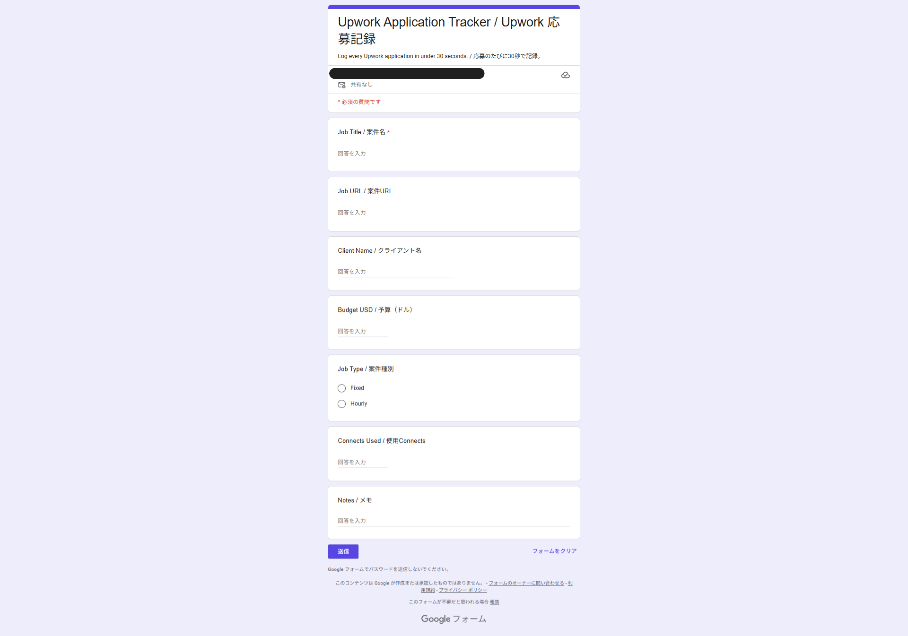
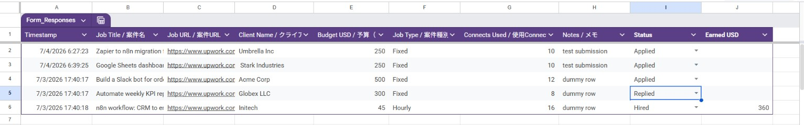
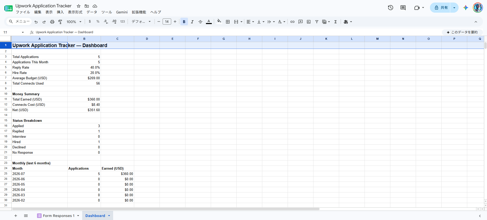

# Upwork 応募トラッカー（フォーム → シート → ダッシュボード）

Upwork への応募を Google フォームで記録し、返信率・採用率・Connects の費用対効果を自動集計するダッシュボードに変換します。外部サービス不要。

---

## 処理の流れ

1. 応募した直後に Google フォームを送信（30秒以内、スマホからでも可）
2. 応募内容がスプレッドシートに自動記録
3. トリガーが該当行に **Status =「Applied」** とドロップダウンを自動付与
   （`Applied / Replied / Interview / Hired / Declined / No Response`）
4. 進捗に応じてステータスを手動更新、報酬受取時に **Earned USD** を入力
5. **Dashboard シート**が即座に再計算：返信率・採用率・平均予算・
   Connects コストと収入の収支・月別推移

---

## スクリーンショット

### 入力フォーム（回答者画面）


### 応募記録シート（ステータス列付き）


### KPI ダッシュボード


---

## セットアップ手順

### 1. clasp でデプロイする

```bash
clasp create --type standalone --title "08 Upwork Application Tracker"
clasp push --force
```

### 2. `createForm()` を実行する（初回のみ）

GAS エディタで `createForm` を選択 → 実行。
Google フォーム（7項目・英日併記ラベル）と連携スプレッドシートが自動生成されます。
実行ログから **スプレッドシート ID** をコピーしてください。

### 3. スクリプトを設定する

`upwork_tracker.js` を開いて ID を設定：

```js
var SPREADSHEET_ID = "スプレッドシートのID";
```

設定後、再度 `clasp push --force`。

### 4. `setupDashboard()` を実行する（初回のみ）

KPI 数式入りの Dashboard シートが生成されます。
権限の許可ダイアログが表示されたら承認してください。

### 5. `setupTrigger()` を実行する（初回のみ）

フォーム送信トリガーを登録します（重複トリガーは自動削除）。

### 6. 動作確認

`testSetup()` を実行 → ダミー応募3件（Applied / Replied / Hired・収入 $360）が挿入され、
シート記録・ステータスドロップダウン・Dashboard の全数式を検証できます。

---

## Dashboard の集計項目

| セクション | 内容 |
|-----------|------|
| 応募 KPI | 累計応募数・今月応募数・返信率・採用率・平均予算・Connects 合計 |
| 収支サマリー | 総収入・Connects コスト（× $0.15、`CONNECT_COST_USD` で変更可）・純収支 |
| ステータス内訳 | 6 ステータスごとの件数 |
| 月別推移 | 直近 6 ヶ月の応募数と収入 |

---

## ファイル構成

```
08_upwork-application-tracker/
├── upwork_tracker.js  # メインスクリプト
├── appsscript.json    # GAS 設定ファイル
├── img/               # スクリーンショット（ダミーデータのみ）
└── README_ja.md
```

---

## 主要な関数

| 関数名 | 処理内容 |
|--------|---------|
| `createForm()` | フォーム＋連携シートを自動生成（初回のみ） |
| `onFormSubmit(e)` | 送信ごとに Status="Applied" とドロップダウンを付与 |
| `setupDashboard()` | 数式入り Dashboard シートを生成（初回のみ） |
| `setupTrigger()` | フォーム送信トリガーを登録（初回のみ） |
| `testSetup()` | 検証用ダミー応募3件を挿入 |

---

## ライセンス

MIT
