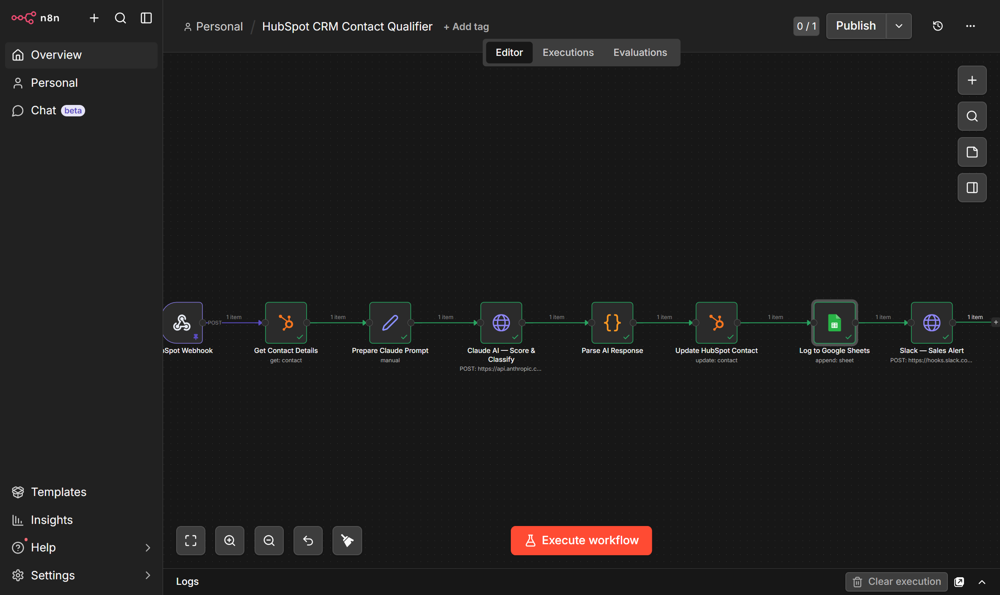
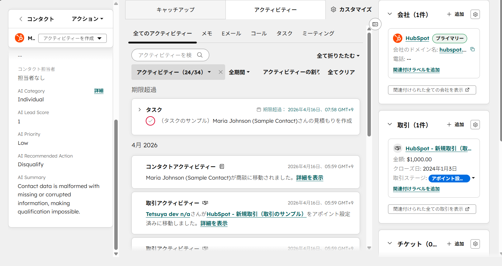
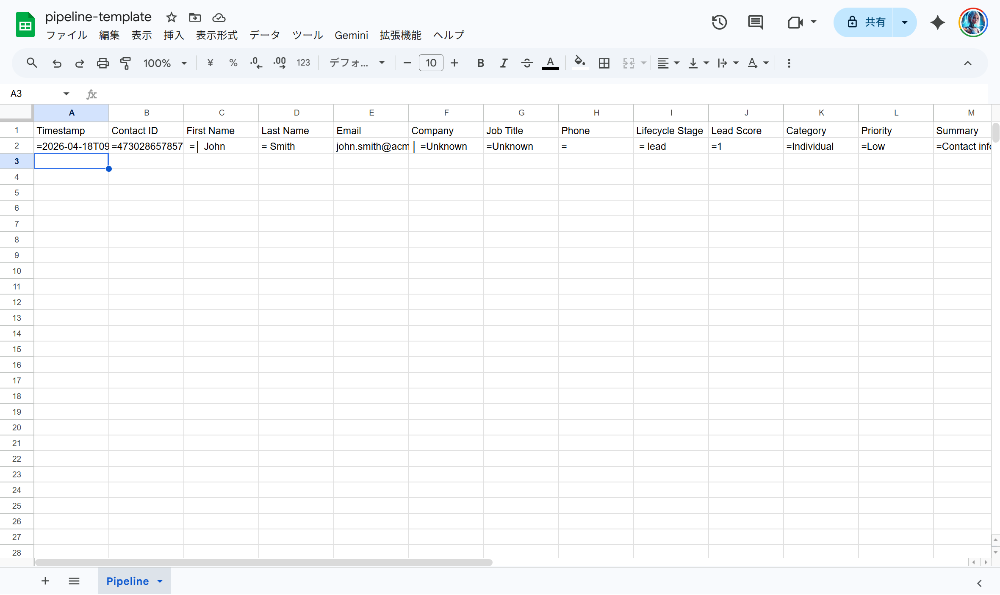
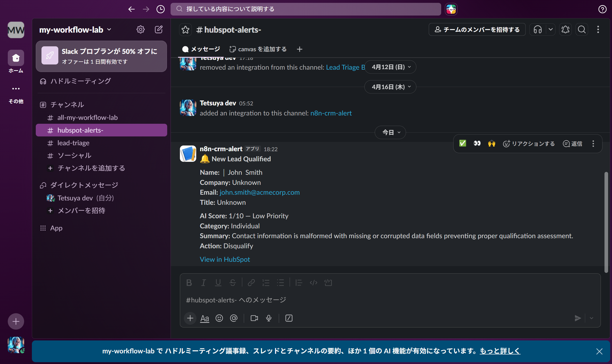

# HubSpot CRM Contact Qualifier

Automatically qualifies new HubSpot contacts using Claude AI, syncs enriched data back to HubSpot, and alerts the sales team via Slack — all within seconds of contact creation.

## Overview

When a new contact is created in HubSpot CRM, this workflow:
1. Fetches full contact details from HubSpot
2. Sends the profile to Claude AI for lead scoring and classification
3. Writes the AI score and tags back to HubSpot contact properties
4. Logs the enriched record to a Google Sheets pipeline tracker
5. Posts a Slack alert to the sales channel with an AI-generated summary

## Workflow

```
Webhook (POST from HubSpot contact.creation subscription)
  → Get Contact Details (HubSpot API)
  → Build Claude Prompt (Set)
  → Claude AI — Score & Classify (HTTP Request)
  → Parse AI Response (Code)
  → Update HubSpot Contact Properties
  → Append to Google Sheets
  → Slack Alert (Incoming Webhook)
```

The flow is intentionally sequential so that Slack fires exactly once per lead,
and a downstream failure (e.g. Sheets quota error) still leaves HubSpot updated.



## Screenshots

### HubSpot Contact — AI Tags Applied


### Google Sheets Pipeline Tracker


### Slack Sales Alert


## Tech Stack

| Tool | Role |
|------|------|
| **n8n** (self-hosted, Docker) | Workflow orchestration |
| **HubSpot CRM API** | Trigger + bidirectional contact sync |
| **Claude API** (claude-haiku-4-5-20251001) | Lead scoring & classification |
| **Google Sheets** | Portable pipeline tracker |
| **Slack** (Incoming Webhook) | Real-time sales team alerts |

## AI Classification Output

Claude scores each new contact across four dimensions:

| Field | Values |
|-------|--------|
| `lead_score` | 1–10 (integer) |
| `category` | Enterprise / SMB / Individual / Agency |
| `priority` | High / Medium / Low |
| `summary` | One-sentence qualification rationale |
| `recommended_action` | Call / Email Follow-up / Nurture / Disqualify |

These values are written back to HubSpot as custom contact properties.

## Setup

### Prerequisites

- Docker Desktop installed
- HubSpot account (free tier works) with a Private App (OAuth token)
- Claude API key
- Google Cloud service account with Sheets access
- Slack Incoming Webhook URL

### 1. Configure HubSpot Custom Properties

In HubSpot, create the following custom contact properties:
- `ai_lead_score` (Number)
- `ai_category` (Single-line text)
- `ai_priority` (Dropdown: High / Medium / Low)
- `ai_summary` (Multi-line text)
- `ai_recommended_action` (Single-line text)

### 2. Set Up HubSpot Webhook Subscription

In HubSpot → Settings → Integrations → Private Apps → Webhooks:
- Subscribe to: `contact.creation`
- Target URL: `http://YOUR_N8N_HOST:5678/webhook/hubspot-contact`

### 3. Start n8n

```bash
cp .env.example .env
# Fill in your credentials in .env
docker compose up -d
```

### 4. Import Workflow

1. Open n8n at `http://localhost:5678`
2. Go to Workflows → Import from File
3. Select `workflow.json`
4. Configure credentials for HubSpot, Google Sheets, and Slack nodes
5. Activate the workflow

### Environment Variables

```env
CLAUDE_API_KEY=your_claude_api_key
HUBSPOT_ACCESS_TOKEN=your_hubspot_private_app_token
SLACK_WEBHOOK_URL=https://hooks.slack.com/services/xxx/yyy/zzz
GOOGLE_SHEETS_ID=your_spreadsheet_id
```

## Google Sheets Column Schema

| Column | Source |
|--------|--------|
| Timestamp | n8n execution time |
| Contact ID | HubSpot |
| First Name | HubSpot |
| Last Name | HubSpot |
| Email | HubSpot |
| Company | HubSpot |
| Job Title | HubSpot |
| Phone | HubSpot |
| Lifecycle Stage | HubSpot |
| Lead Score | Claude AI |
| Category | Claude AI |
| Priority | Claude AI |
| Summary | Claude AI |
| Recommended Action | Claude AI |

## Security Notes

- **Webhook signature verification**: HubSpot signs every webhook request with
  `X-HubSpot-Signature-v3`. For production, extend the Webhook node with a Code
  node that verifies the HMAC-SHA256 signature against your HubSpot app secret
  and rejects mismatches. Omitted here to keep the demo importable.
- **Secrets**: all credentials are loaded from `.env` via docker-compose
  environment injection. Never commit `.env` — only `.env.example` is tracked.

## Slack Alert Format

```
🔔 New Lead Qualified

Name: John Smith
Company: Acme Corp
Email: john@acme.com

AI Score: 8/10 — High Priority
Category: Enterprise
Summary: VP-level contact at a 500-person company actively evaluating automation tools.
Action: Schedule intro call within 24 hours.
```
