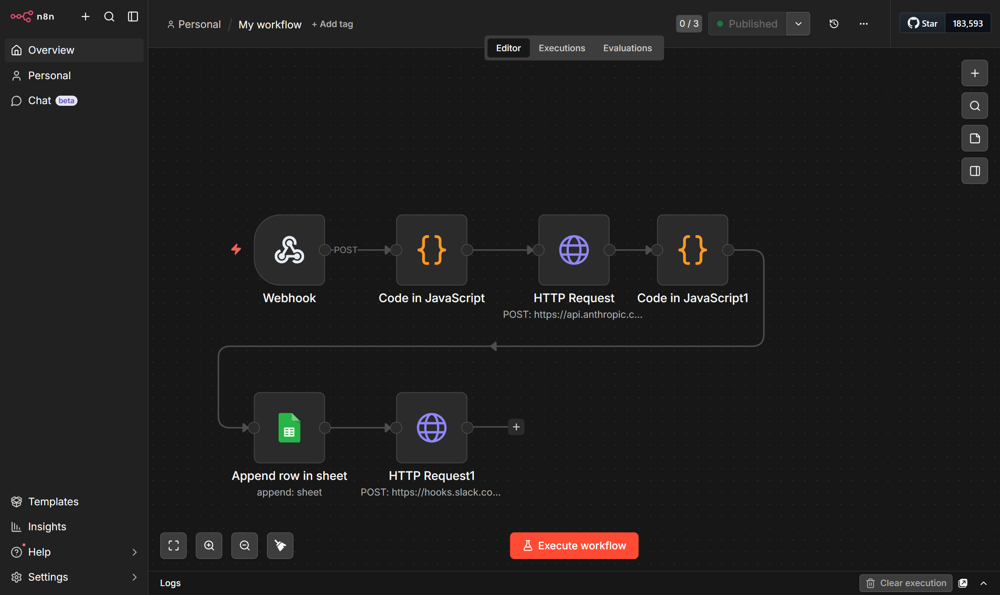
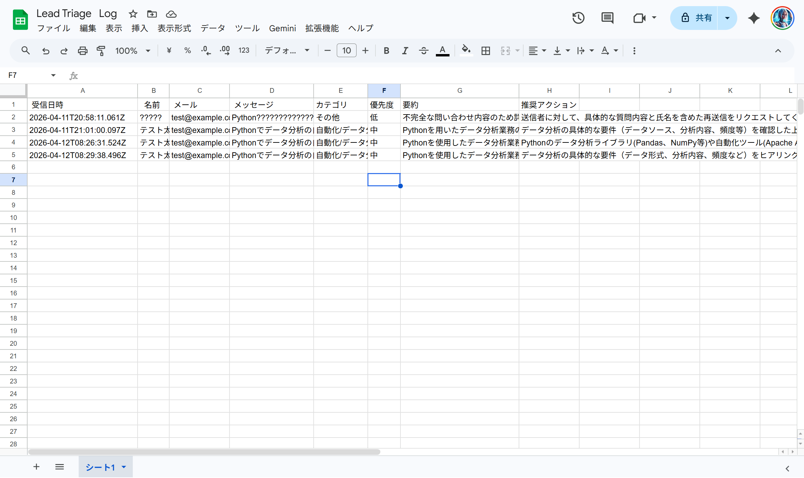
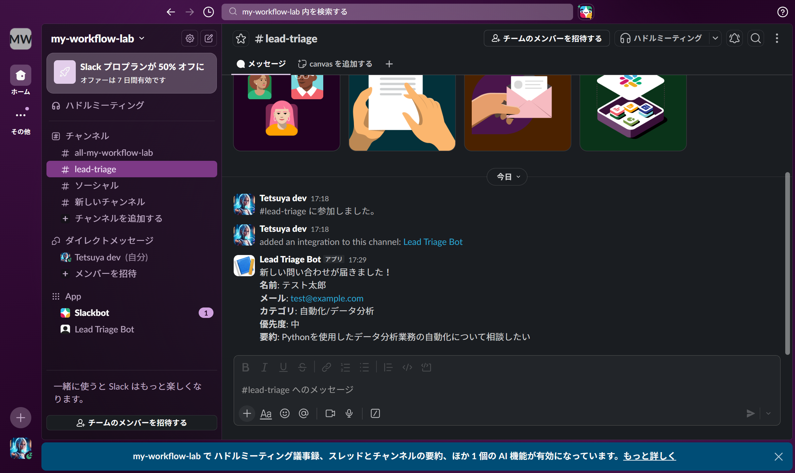

# AI Lead Triage Automation

An automated lead triage workflow built with n8n, Claude AI, Google Sheets, and Slack.

## Overview

When a contact form submission comes in via Webhook, this workflow automatically:
1. Analyzes the inquiry using Claude AI (category, priority, summary)
2. Logs the result to Google Sheets
3. Sends a Slack notification to the team

## Workflow

```
Webhook → Claude AI (Haiku) → Google Sheets → Slack
```



## Screenshots

### Google Sheets Log


### Slack Notification


## Tech Stack

- **n8n** (self-hosted via Docker) — workflow automation
- **Claude API** (claude-haiku-4-5-20251001) — AI-powered triage
- **Google Sheets** — lead log storage
- **Slack** (Incoming Webhook) — real-time notifications

## AI Analysis Output

Claude AI classifies each inquiry into:

| Field | Values |
|-------|--------|
| category | 自動化 / データ分析 / レポート / その他 |
| priority | 高 / 中 / 低 |
| summary | One-sentence summary |
| recommended_action | Next action suggestion |

## Setup

### Prerequisites

- Docker Desktop
- n8n (self-hosted)
- Anthropic API key
- Google Cloud account (for Sheets OAuth)
- Slack workspace + Incoming Webhook URL

### Run n8n

```bash
docker compose up -d
```

Access n8n at `http://localhost:5678`

### Environment

Configure the following credentials in n8n:
- **Anthropic API key** — for Claude AI HTTP Request node
- **Google Sheets OAuth2** — for Google Sheets node
- **Slack Incoming Webhook URL** — for Slack notification node

## Example Slack Notification

```
新しい問い合わせが届きました！
名前: テスト太郎
メール: test@example.com
カテゴリ: 自動化/データ分析
優先度: 中
要約: Pythonを使用したデータ分析業務の自動化について相談したい
```

## Testing

```powershell
$body = [System.Text.Encoding]::UTF8.GetBytes('{"name":"テスト太郎","email":"test@example.com","message":"Pythonでデータ分析の自動化をしたい"}')
Invoke-RestMethod -Uri "http://localhost:5678/webhook/<your-webhook-id>" -Method POST -ContentType "application/json; charset=utf-8" -Body $body
```
